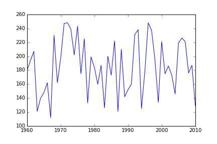
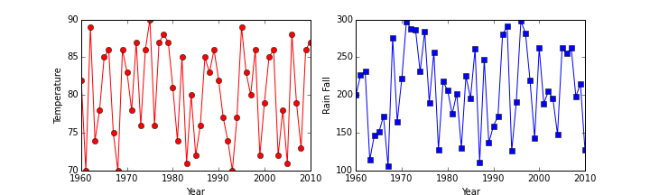

## Introduction

This material assumes that you have programmed before. This first
lecture provides a quick introduction to programming in Python for
those who either haven't used Python before or need a quick
refresher.

Let's start with a hypothetical problem we want to solve. We are
interested in understanding the relationship between the weather and
the number of mosquitos occuring in a particular year so that we can
plan mosquito control measures accordingly. Since we want to apply
these mosquito control measures at a number of different sites we
need to understand both the relationship at a particular site and
whether or not it is consistent across sites. The data we have to
address this problem comes from the local government and are stored
in tables in comma-separated values (CSV) files. Each file holds the
data for a single location, each row holds the information for a
single year at that location, and the columns hold the data on both
mosquito numbers and the average temperature and rainfall from the
beginning of mosquito breeding season. The first few rows of our
first file look like:

~~~
year,temperature,rainfall,mosquitos
2001,87,222,198
2002,72,103,105
2003,77,176,166
~~~

> ## Learning Objectives {.objectives}
> 
> * Conduct variable assignment, looping, and conditionals in Python
> * Use an external Python library
> * Read tabular data from a file
> * Subset and perform analysis on data
> * Display simple graphs

## Loading Data

In order to load the data, we need to import a library called Pandas
that knows how to operate on tables of data.

~~~ {.python}
import pandas
~~~

We can now use Pandas to read our data file.

~~~ {.python}
pandas.read_csv('mosquito_data_A1.csv')
~~~

~~~ {.output}
   year  temperature  rainfall  mosquitos
0  2001           87       222        198
1  2002           72       103        105
2  2003           77       176        166
3  2004           89       236        210
4  2005           88       283        242
5  2006           89       151        147
6  2007           71       121        117
7  2008           88       267        232
8  2009           85       211        191
9  2010           75       101        106
~~~

The `read_csv()` function belongs to the `pandas` library. In order
to run it we need to tell Python that it is part of `pandas` and we
do this using the dot notation, which is used everywhere in Python
to refer to parts of larger things.

When we are finished typing and press Shift+Enter, the notebook runs
our command and shows us its output. In this case, the output is the
data we just loaded.

Our call to `pandas.read_csv()` read data into memory, but didn't
save it anywhere. To do that, we need to assign the array to a
variable. In Python we use `=` to assign a new value to a variable
like this:

~~~ {.python}
data = pandas.read_csv('mosquito_data_A1.csv')
~~~

This statement doesn't produce any output because assignment doesn't
display anything. If we want to check that our data has been loaded,
we can print the variable's value:

~~~ {.python}
print data
~~~

~~~ {.output}
   year  temperature  rainfall  mosquitos
0  2001           87       222        198
1  2002           72       103        105
2  2003           77       176        166
3  2004           89       236        210
4  2005           88       283        242
5  2006           89       151        147
6  2007           71       121        117
7  2008           88       267        232
8  2009           85       211        191
9  2010           75       101        106

~~~

`print data` tells Python to display the text. Alternatively we
could just include `data` as the last value in a code cell:

~~~ {.python}
data
~~~

~~~ {.output}
   year  temperature  rainfall  mosquitos
0  2001           87       222        198
1  2002           72       103        105
2  2003           77       176        166
3  2004           89       236        210
4  2005           88       283        242
5  2006           89       151        147
6  2007           71       121        117
7  2008           88       267        232
8  2009           85       211        191
9  2010           75       101        106
~~~

This tells the IPython Notebook to display the `data` object, which
is why we see a pretty formated table.

## Manipulating data

Once we have imported the data we can start doing things with it.
First, let's ask what type of thing `data` refers to:

~~~ {.python}
print type(data)
~~~

~~~ {.output}
<class 'pandas.core.frame.DataFrame'>

~~~

The data is stored in a data structure called a DataFrame. There are
other kinds of data structures that are also commonly used in
scientific computing including Numpy arrays, and Numpy matrices,
which can be used for doing linear algebra.

We can select an individual column of data using its name:

~~~ {.python}
print data['year']
~~~

~~~ {.output}
0    2001
1    2002
2    2003
3    2004
4    2005
5    2006
6    2007
7    2008
8    2009
9    2010
Name: year, dtype: int64

~~~

Or we can select several columns of data at once:

~~~ {.python}
print data[['rainfall', 'temperature']]
~~~

~~~ {.output}
   rainfall  temperature
0       222           87
1       103           72
2       176           77
3       236           89
4       283           88
5       151           89
6       121           71
7       267           88
8       211           85
9       101           75

~~~

We can also select subsets of rows using slicing. Say we just want
the first two rows of data:

~~~ {.python}
print data[0:2]
~~~

~~~ {.output}
   year  temperature  rainfall  mosquitos
0  2001           87       222        198
1  2002           72       103        105

~~~

There are a couple of important things to note here. First, Python
indexing starts at zero. In contrast, programming languages like R
and MATLAB start counting at 1, because that's what human beings
have done for thousands of years. Languages in the C family
(including C++, Java, Perl, and Python) count from 0 because that's
simpler for computers to do. This means that if we have 5 things in
Python they are numbered 0, 1, 2, 3, 4, and the first row in a data
frame is always row 0.

The other thing to note is that the subset of rows starts at the
first value and goes up to, but does not include, the second value.
Again, the up-to-but-not-including takes a bit of getting used to,
but the rule is that the difference between the upper and lower
bounds is the number of values in the slice.

One thing that we can't do with this syntax is directly ask for the
data from a single row:

~~~ {.python}
data[1]
~~~

~~~ {.output}
---------------------------------------------------------------------------
KeyError                                  Traceback (most recent call last)
<ipython-input-10-c805864c0d75> in <module>()
----> 1 data[1]

/usr/lib/python2.7/dist-packages/pandas/core/frame.pyc in __getitem__(self, key)
   2001             # get column
   2002             if self.columns.is_unique:
-> 2003                 return self._get_item_cache(key)
   2004 
   2005             # duplicate columns

/usr/lib/python2.7/dist-packages/pandas/core/generic.pyc in _get_item_cache(self, item)
    665             return cache[item]
    666         except Exception:
--> 667             values = self._data.get(item)
    668             res = self._box_item_values(item, values)
    669             cache[item] = res

/usr/lib/python2.7/dist-packages/pandas/core/internals.pyc in get(self, item)
   1653     def get(self, item):
   1654         if self.items.is_unique:
-> 1655             _, block = self._find_block(item)
   1656             return block.get(item)
   1657         else:

/usr/lib/python2.7/dist-packages/pandas/core/internals.pyc in _find_block(self, item)
   1933 
   1934     def _find_block(self, item):
-> 1935         self._check_have(item)
   1936         for i, block in enumerate(self.blocks):
   1937             if item in block:

/usr/lib/python2.7/dist-packages/pandas/core/internals.pyc in _check_have(self, item)
   1940     def _check_have(self, item):
   1941         if item not in self.items:
-> 1942             raise KeyError('no item named %s' % com.pprint_thing(item))
   1943 
   1944     def reindex_axis(self, new_axis, method=None, axis=0, copy=True):

KeyError: u'no item named 1'
~~~

This is because there are several things that we could mean by
`data[1]` so if we want a single row we can either take a slice that
returns a single row:

~~~ {.python}
print data[1:2]
~~~

~~~ {.output}
   year  temperature  rainfall  mosquitos
1  2002           72       103        105

~~~

or use the `.iloc` method, which stands for "integer location" since
we are looking up the row based on its integer index.

~~~ {.python}
print data.iloc[1]
~~~

~~~ {.output}
year           2002
temperature      72
rainfall        103
mosquitos       105
Name: 1, dtype: int64

~~~

We can also use this same syntax for getting larger subsets of rows:

~~~ {.python}
print data.iloc[1:3]
~~~

~~~ {.output}
   year  temperature  rainfall  mosquitos
1  2002           72       103        105
2  2003           77       176        166

~~~

We can also subset the data based on the value of other rows:

~~~ {.python}
print data['temperature'][data['year'] > 2005]
~~~

~~~ {.output}
5    89
6    71
7    88
8    85
9    75
Name: temperature, dtype: int64

~~~

Data frames also know how to perform common mathematical operations
on their values. If we want to find the average value for each
variable, we can just ask the data frame for its mean values

~~~ {.python}
print data.mean()
~~~

~~~ {.output}
year           2005.5
temperature      82.1
rainfall        187.1
mosquitos       171.4
dtype: float64

~~~

Data frames have lots of useful methods:

~~~ {.python}
print data.max()
~~~

~~~ {.output}
year           2010
temperature      89
rainfall        283
mosquitos       242
dtype: int64

~~~

~~~ {.python}
print data['temperature'].min()
~~~

~~~ {.output}
71

~~~

~~~ {.python}
print data['mosquitos'][1:3].std()
~~~

~~~ {.output}
43.1335136524

~~~

> ## Challenge {.challenge}
> 
> Import the data from `mosquito_data_A2.csv`, create a new variable
> that holds a data frame with only the weather data, and print the
> means and standard deviations for the weather variables.

## Loops

Once we have some data we often want to be able to loop over it to
perform the same operation repeatedly.  A `for` loop in Python takes
the general form

~~~
for item in list:
    do_something
~~~

So if we want to loop over the temperatures and print out there
values in degrees Celcius (instead of Farenheit) we can use:

~~~ {.python}
temps = data['temperature']
for temp_in_f in temps:
    temp_in_c = (temp_in_f - 32) * 5 / 9.0
    print temp_in_c
~~~

~~~ {.output}
30.5555555556
22.2222222222
25.0
31.6666666667
31.1111111111
31.6666666667
21.6666666667
31.1111111111
29.4444444444
23.8888888889

~~~

That looks good, but why did we use 9.0 instead of 9? The reason is
that computers store integers and numbers with decimals as different
types: integers and floating point numbers (or floats). Addition,
subtraction and multiplication work on both as we'd expect, but
division works differently. If we divide one integer by another, we
get the quotient without the remainder:

~~~ {.python}
print '10/3 is:', 10 / 3
~~~

~~~ {.output}
10/3 is: 3

~~~

If either part of the division is a float, on the other hand, the
computer creates a floating-point answer:

~~~ {.python}
print '10/3.0 is:', 10 / 3.0
~~~

~~~ {.output}
10/3.0 is: 3.33333333333

~~~

The computer does this for historical reasons: integer operations
were much faster on early machines, and this behavior is actually
useful in a lot of situations. However, it's still confusing, so
Python 3 produces a floating-point answer when dividing integers if
it needs to. We're still using Python 2.7 in this class, so if we
want 5/9 to give us the right answer, we have to write it as 5.0/9,
5/9.0, or some other variation.

## Conditionals

The other standard thing we need to know how to do in Python is
conditionals, or if/then/else statements. In Python the basic syntax
is:

~~~python
if condition:
    do_something
~~~

So if we want to loop over the temperatures and print out only those
temperatures that are greater than 80 degrees we would use:

~~~ {.python}
temp = data['temperature'][0]
if temp > 80:
    print "The temperature is greater than 80"
~~~

~~~ {.output}
The temperature is greater than 80

~~~

We can also use `==` for equality, `<=` for less than or equal to,
`>=` for greater than or equal to, and `!=` for not equal to.

Additional conditions can be handled using `elif` and `else`:

~~~ {.python}
temp = data['temperature'][0]
if temp < 87:
    print "The temperature is < 87"
elif temp > 87:
    print "The temperature is > 87"
else:
    print " The temperature is equal to 87"
~~~

~~~ {.output}
 The temperature is equal to 87

~~~

> ## Challenge {.challenge}
> 
> Import the data from `mosquito_data_A2.csv`, determine the mean
> temperate, and loop over the temperature values. For each value
> print out whether it is greater than the mean, less than the mean,
> or equal to the mean.

## Plotting

The mathematician Richard Hamming once said, "The purpose of
computing is insight, not numbers," and the best way to develop
insight is often to visualize data. The main plotting library in
Python is `matplotlib`. To get started, let's tell the IPython
Notebook that we want our plots displayed inline, rather than in a
separate viewing window:

~~~ {.python}
%matplotlib inline
~~~

The `%` at the start of the line signals that this is a command for
the notebook, rather than a statement in Python. Next, we will
import the `pyplot` module from `matplotlib`, but since `pyplot` is
a fairly long name to type repeatedly let's give it an alias.

~~~ {.python}
from matplotlib import pyplot as plt
~~~

This import statement shows two new things. First, we can import
part of a library by using the `from library import submodule`
syntax. Second, we can use a different name to refer to the imported
library by using `as newname`.

Now, let's make a simple plot showing how the number of mosquitos
varies over time. We'll use the site you've been doing exercises
with since it has a longer time-series.

~~~ {.python}
data = pandas.read_csv('mosquito_data_A2.csv')
plt.plot(data['year'], data['mosquitos'])
~~~

~~~ {.output}
[<matplotlib.lines.Line2D at 0x4a88590>]
~~~

More complicated plots can be created by adding a little additional
information. Let's say we want to look at how the different weather
variables vary over time.

~~~ {.python}
plt.figure(figsize=(10.0, 3.0))

plt.subplot(1, 2, 1)
plt.plot(data['year'], data['temperature'], 'ro-')
plt.xlabel('Year')
plt.ylabel('Temperature')

plt.subplot(1, 2, 2)
plt.plot(data['year'], data['rainfall'], 'bs-')
plt.xlabel('Year')
plt.ylabel('Rain Fall')
plt.show()
~~~

> ## Challenge {.challenge}
> 
> Using the data in `mosquito_data_A2.csv` plot the relationship
> between the number of mosquitos and temperature and the number of
> mosquitos and rainfall.

### Key Points

*   Import a library into a program using `import libraryname`.
*   Use the `pandas` library to work with data tables in Python.
*   Use `variable = value` to assign a value to a variable.
*   Use `print something` to display the value of `something`.
*   Use `dataframe['columnname']` to select a column of data.
*   Use `dataframe[start_row:stop_row]` to select rows from a data frame.
*   Indices start at 0, not 1.
*   Use `dataframe.mean()`, `dataframe.max()`, and `dataframe.min()`
    to calculate simple statistics.
*   Use `for x in list:` to loop over values
*   Use `if condition:` to make conditional decisions
*   Use the `pyplot` library from `matplotlib` for creating simple
    visualizations.

## Next steps

With the requisite Python background out of the way, now we're ready
to dig in to analyzing our data, and along the way learn how to
write better code, more efficiently, that is more likely to be
correct.
